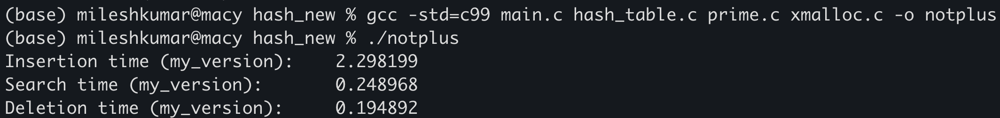

# An implementation of hashtables in C

This implements strings (key) to strings (value). However, 
it can be changed to accomodate other types only with relatively few changes.
It uses open-addressing with double hashing for handling collisions. The methods this version provides have been listed below:
  1.  `ht_insert(hash_table_pointer, key, value)`
  2.  `ht_search(hash_table_pointer, key)`:	returns the value associated with the key, or NULL in case the pair is not found.
  3.  `ht_delete(hash_table_pointer, key)`:	deletes a key value pair from the table, or does nothing in case the pair couldn't be found.
  4.  `ht_new()`:		returns a pointer to an empty hash_table (type) item with an initial size of 500.
  5.  `ht_delete_hash_table(hash_table_pointer)`:		deletes all the key-value pairs from the table and frees the memory.

## Structure of the table:
Calling the `ht_new()` function creates a new empty hash table. A hash table is a struct with the following fields that can be accessed.
1. `size`: the current size of the table.
2. `count`: the count of occupied buckets.
3. `size_index`: a representation of the base size of the table (useful while resizing).
4. `items`: a pointer to pointers of indices of the buckets. Each item in turn is a struct with the fields: key and value.

## Handling Collisions:
This implementation uses open-addressing to handle collisions. It applies two hashing functions till we find an empty bucket to store the key-value pair. 
The library uses the following hash function:
  > index = (hash_a(string) + (i * (hash_b(string) + 1))) % m

where, i is the number of collisions and m is the current size of the table.

## The Hashing Function
The functions `hash_a(string)` and `hash_b(string)` are identical except for the choice of primes in them.
hash_a(string) is defined as follows:

    hash = 0
    string_len = length(string)
    for i = 0, 1, ..., string_len:
        hash += (a ** (string_len - (i+1))) * char_code(string[i])
    hash = hash % num_buckets
    return hash
where a is a prime of our choice and num_buckets is the current size of our table. For this implementation, 
we use the primes 151 and 163 for `hash_a()` and `hash_b()` respectively. 

## Dynamic Resizing:
This implementation also provides dynamic resiszing of the table. In case, the load factor, ratio of empty buckets to the total number of buckets,
goes above 0.7, the hash_table is resized to a prime number nearly double the previous size. In case the load factor falls below 0.3, it is resized
to nearly half of the previous size. The load factor is calculated at every call of the ht_insert() and ht_delete() function.

## Performance against the c++ standard library
This implementation is unsurprisingly slower the `unordered_map` defined the standard library of c++. A test was performed to compare the insertion, deletion,
and search time of the two libraries. The test comprised of inserting, searching and deleting roughly 100,000 unique words into the hash_table and the `unordered_map<>`
respectively. The results have been shown below.

